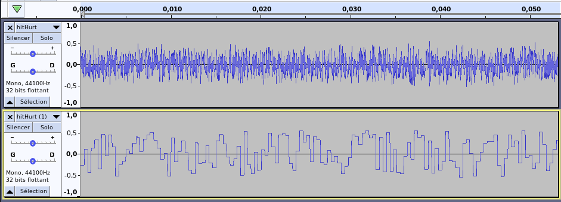

# 08 Noise
## Table of Contents
- [08 Noise](#08-noise)
  - [Table of Contents](#table-of-contents)
  - [Disclaimer](#disclaimer)
  - [What I've learned](#what-ive-learned)
    - [NES / Gameboy noise is not handled like you think](#nes--gameboy-noise-is-not-handled-like-you-think)
    - [implementing it in arduino / mozzi](#implementing-it-in-arduino--mozzi)
   
## Disclaimer
I'm not a c++ developer nor a arduino expert. I try -with my developer experience- to mimic some classic development technics in order to build simple things. If I say some bs, feel free to make a PR to correct me ! 
## What I've learned

### NES / Gameboy noise is not handled like you think
When you hear a NES track you can figured that the kick and the snare are just noises "SHHHH" at different speed. Slow and low for the kick and fast and high for a snare. Actually I managed to reproduce similar sounds in a different manner.
My guess was to add noise to a wave and by changing the wave length I thought I could apply a kind of "pitch" on the noise. That was not the case.

Looking at https://sfxr.me/ source code, I found out that the only parameter for the noise was a wave period:

- Long wave period (minus hz): NES nice crackling sound.
- Short period (more hz): white noise

In the code you can see that there are no differences when generating the buffer with a long or short period. And that's why noises NES artefacts happened : the numbers of value for a wave period is the same : 
1 second of short wave sound => plenty of data
1 second of long wave sound => not so plenty of data

**Same noise sound, envelop etc... but in different "frequencies"**


### implementing it in arduino / mozzi

```updateAudio``` is called at 16384 times a second so you have to keep your code as simpler as possible. My first guest was to define a noise value ```noise = random(-243, 244)``` and then return this same noise during a amount of time (counting iterations with a ```value++```) and it actually worked.

**08_noise.ino**
```cpp
int noise = random(-244,243);
int count = 0;
int amount = 100; // arbitrary value controlled by a knob
int updateAudio()
{
  if(++count > amount){
    count = 0;
    noise = random(-244,243);
  }
  return noise;
}
 ```
This work well and you can have NES / 8bit similar "noise frequencies" but it's quite difficult to implements with others Mozzi and sounds concepts so I go with a Square Oscillator that can acheive similar results :

**noise.ino**
```cpp
  int value = osc0.next();
  if(value != oldvalue){
    noise = random(-244,243);      
  }
  oldvalue = value;
```

We get the oscillator signal (Square signal is always 127 or -127) so when the value change we create a new "noise". Now, we can use the oscillator in a more "Mozzi way". 
