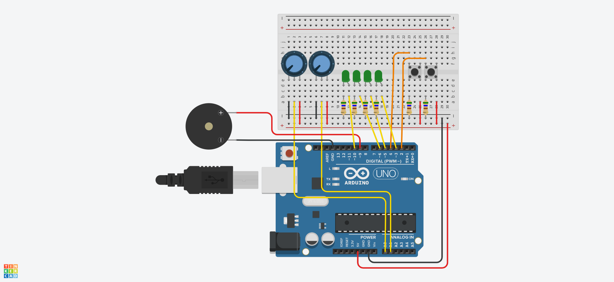

# Mozzi journey

Mozzi (https://sensorium.github.io/Mozzi/) is a powerfull library to create and generate sounds from your arduino.

I'm exploring its API and I'm trying to understand how it work, how to use it (and how to use an arduino).

My initial plan is to build a mini sequencer (as simple as it can be) with 3 tracks : 
The first one for noise generated drums and two osiclators with filters, effects, vibrato etc...

Two buttons, two potentiometers, four LEDs, one speaker (or jack output) 

## Documentation
### Working with vsCode
Todo
### How to proceed with this repository
Todo
### Arduino Circuit

## Todos

#### Documentation

 - [ ] Working with VScode
 - [ ] How to proceed with this repository
 - [x] Arduino Circuit

#### Code

 - [x] HelloWorld
 - [x] Work with Code
 - [x] Serial Terminal in VScode
 - [x] Buttons
 - [x] 4 Leds display 
 - [ ] Potentiometers
 - [ ] Hello Mozzi (first Oscillator)
 - [x] Button Menu
 - [x] Menu Library (Button Menu example in a library)
 - [ ] Tracker
 - [ ] BPM

#### Sound

 - [ ] Wave forms
 - [ ] Duty cycle
 - [ ] Envelope
 - [ ] Notes
 - [ ] Vibrato
 - [ ] Low pass filter
 - [ ] NES noise drumkit like
 - [ ] Slide notes
 - [ ] Flanger

#### Hardware

 - [ ] Velostat controller (https://www.youtube.com/watch?v=zUN2ZYdYAUo, https://www.youtube.com/watch?v=jzylmjtmIkI )
 - [ ] Midi in / out
 - [ ] Rotary ( no intent )